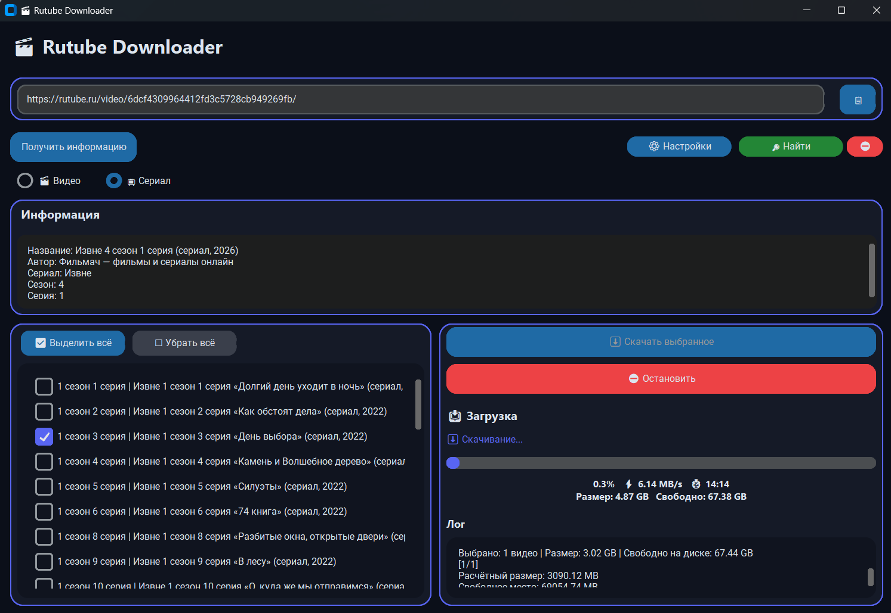

# 🎬 Rutube Downloader



Программа для скачивания видео и сериалов с Rutube.

---

## Возможности

* 🎬 Скачивание отдельных видео
* 📺 Поиск и загрузка сериалов
* 🤖 Автоматический выбор режима загрузки (видео/сериал)
* 🔎 Автоматический поиск сезонов и серий
* 🎚 Выбор качества загрузки
* 👾 Выбор нужных серий 
* 📊 Расчёт размера файлов перед загрузкой
* 💾 Проверка свободного места
* ⚡ Отображение скорости и прогресса загрузки
* ⛔ Остановка загрузки
* ✅ Продолжение загрузки с последнего места
* 🗂 Автоматическая сортировка сериалов по сезонам

---

# Установка

## Windows

1. [Скачайте последнюю версию программы из Releases.](https://github.com/Kirliffilan/RutubeDownloader/releases/latest)
2. Распакуйте архив.
3. Запустите:

```bash
RutubeDownloader.exe
```

---

# Использование

1. В настройках выберите:
- Папку загрузки
- Необходимое качество
- Необходимое количество сезонов и серий
2. Скопируйте ссылку на видео Rutube.
2. Нажмите **"Найти"**.
3. Выберите серии.
4. Нажмите **"Скачать выбранное"**.


# Настройки

## 📁 Папка сохранения

Выбор папки, куда будут сохраняться скачанные файлы.

Пример:

```
D:\Сериалы
```

Для сериалов программа автоматически создаёт структуру:

```
Название сериала
└── 1 сезон
    ├── 1 серия.mp4
    └── 2 серия.mp4
```

---

## 🎚 Качество

Выбор качества загружаемого видео:

* Максимальное
* 2160p
* 1440p
* 1080p
* 720p
* 480p
* 360p

Чем выше качество, тем больше размер файла.

---

## 🔎 Параметры поиска

Настройки количества проверяемых сезонов и серий.

Например:

```
Сезонов: 5
Серий: 20
```

Программа будет искать:

```
1 сезон 1 серия
1 сезон 2 серия
...
5 сезон 20 серия
```

Чем больше значения, тем дольше выполняется поиск.

---
# Решение проблем

## Не найдено видео

Проверьте:

- правильность ссылки;
- доступность видео на Rutube.

---

## Не находятся серии

Попробуйте:

- увеличить количество сезонов или серий в настройках;
- проверить название сериала.

---

## Ошибка загрузки

Попробуйте:

- повторить загрузку;
- проверить интернет-соединение.

**Всегда** можно повторить загрузку через некоторое время, видео продолжит загрузку с последнего места.

---

# Технологии

* Python
* CustomTkinter
* yt-dlp
* SQLite
* Requests

# Лицензия

MIT
